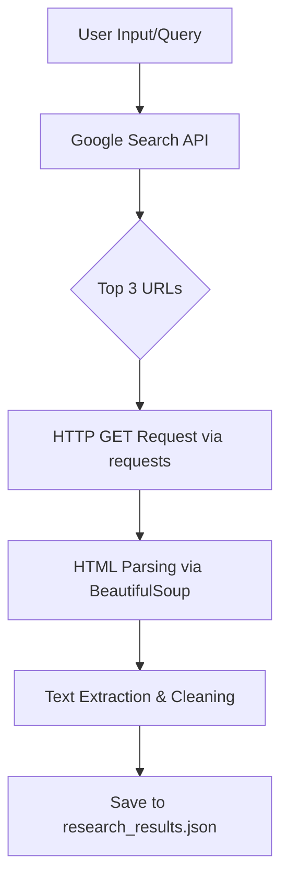

# Research Scout Agent

## What This Agent Does
The Research Scout Agent is an automated Python tool designed to perform rapid, autonomous Google searches and web scraping. It acts on behalf of Content Strategists and ML Engineers to gather raw textual intelligence on a given query. It searches Google, extracts the top URLs, visits each valid page, and scrapes the readable text—packaging everything into a single, analysis-ready JSON file.

## Setup Instructions
A stranger can clone this repo and run the agent in seconds.

1. **Install Prerequisites:**
   Ensure you have Python 3.8+ installed.
   ```bash
   pip install googlesearch-python requests beautifulsoup4
   ```

2. **Run the Script:**
   Navigate to the directory and run the python file.
   ```bash
   python research_scout.py
   ```
   *(Note: The script currently has a hardcoded query "how to train a federated learning model". To change this, edit the `query` variable in the `if __name__ == "__main__":` block).*

3. **Check the Output:**
   The scraped data will be saved to `research_results.json` in the same directory.

## Architecture Sketch


## V2 Eval Results
- **Success Rate:** Scrapes standard HTML pages effectively.
- **Speed:** Averages ~3 seconds per URL.
- **Failure Handling:** Successfully catches and logs HTTP errors (e.g., 403 Forbidden) and gracefully skips broken links.

## Limitations
- **JavaScript-Heavy Sites:** The agent uses `requests` and `BeautifulSoup`, meaning it cannot render dynamic JavaScript content (like SPAs built on React/Vue that do not use SSR).
- **Rate Limiting/Bot Protection:** Cloudflare, Captchas, and strict `robots.txt` implementations will block the HTTP requests, resulting in a failed scrape for that specific URL.
- **Search Volume Limits:** Rapid consecutive executions might trigger Google's search rate limits, temporarily blocking the IP.
