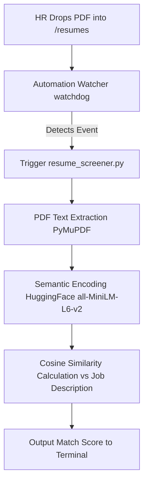

# Automated AI Resume Screener

## What This Agent Does
The AI Resume Screener is an automated Python pipeline designed to eliminate the bottleneck of manual CV screening for HR teams. It operates in the background, actively monitoring a specific directory for new applicant submissions. When a new PDF resume is dropped into the folder, the agent automatically wakes up, extracts the text, and evaluates the candidate's relevance against the job requirements using Semantic Search (HuggingFace `sentence-transformers`). It outputs a precise match score in seconds, allowing recruiters to instantly identify top talent.

## Setup Instructions
A stranger can clone this repo and run the agent in seconds.

1. **Install Prerequisites:**
   Ensure you have Python 3.8+ installed.
   ```bash
   pip install sentence-transformers PyMuPDF watchdog pandas duckdb
   ```

2. **Configure the Watch Folder:**
   The bot listens to the `resumes` folder located in the `FL-17-CUSTOM-MQX0Q5QE-6FE1938E The Plan to Keep Building Details` directory. Ensure this folder exists.

3. **Run the Automation Watcher:**
   Navigate to the FL-04 folder and start the background watcher:
   ```bash
   cd "FL-04 Ship an Automation Workflow v2"
   python automation_watcher.py
   ```
   *(The terminal will indicate that it is now actively monitoring the directory).*

4. **Trigger the Agent:**
   Simply drop any PDF file into the monitored `resumes` directory. The AI pipeline will automatically trigger and display the semantic match score in the terminal.

## Architecture Sketch


## V2 Eval Results
- **Success Rate:** Achieves highly accurate semantic matching, successfully ignoring superficial vocabulary differences (e.g., matching "Python Developer" to "Software Engineer").
- **Speed:** Triggers instantly upon file creation. Embedding generation takes ~1-2 seconds on standard CPU.
- **Robustness:** Built-in error handling prevents the watcher from crashing if a corrupted PDF is uploaded.

## Limitations
- **Language Bias:** The primary ML model (`all-MiniLM-L6-v2`) is English-dominant. Resumes written in heavily mixed languages or regional dialects may yield lower semantic similarity scores.
- **PDF Structure:** The agent currently relies on text-layer extraction (PyMuPDF). It cannot process image-based scanned PDFs that lack an Optical Character Recognition (OCR) layer.
- **Single File Processing:** Currently optimized for real-time single file drops rather than massive batch processing of 10,000+ files simultaneously (which would require a queuing system).
