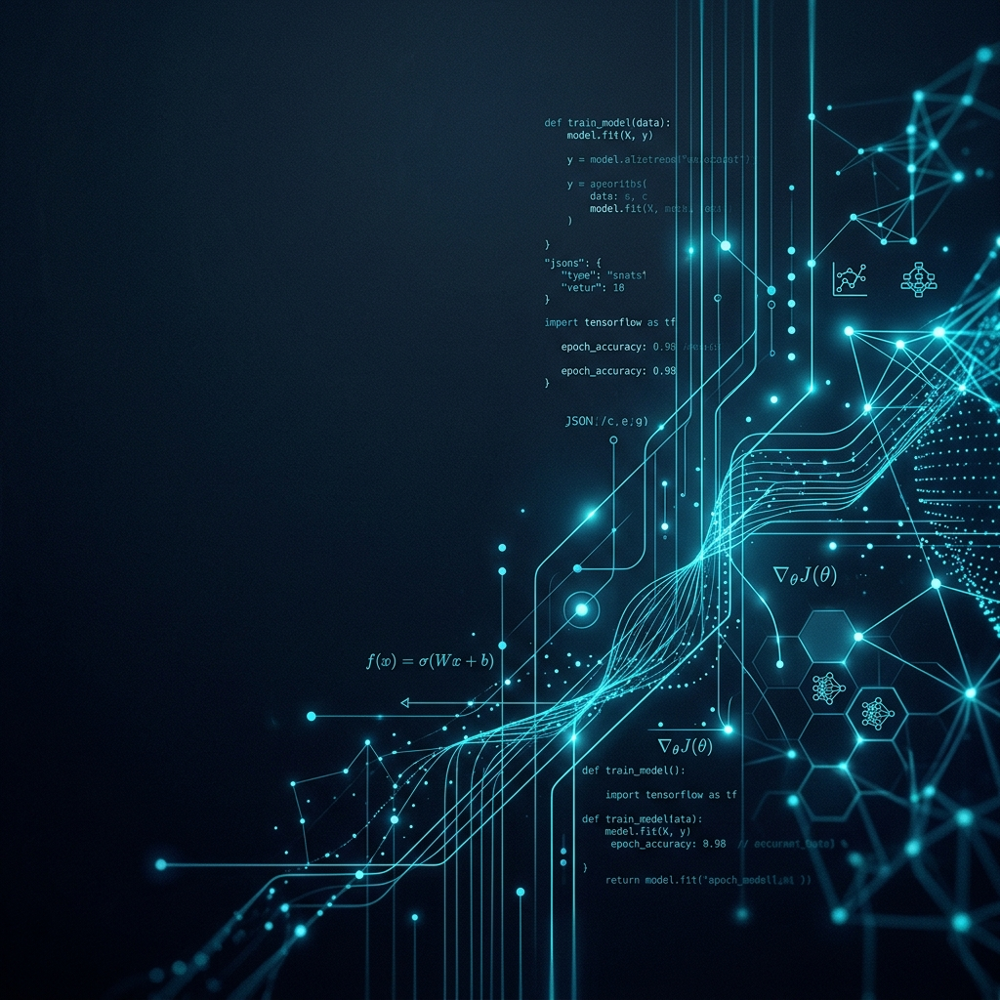
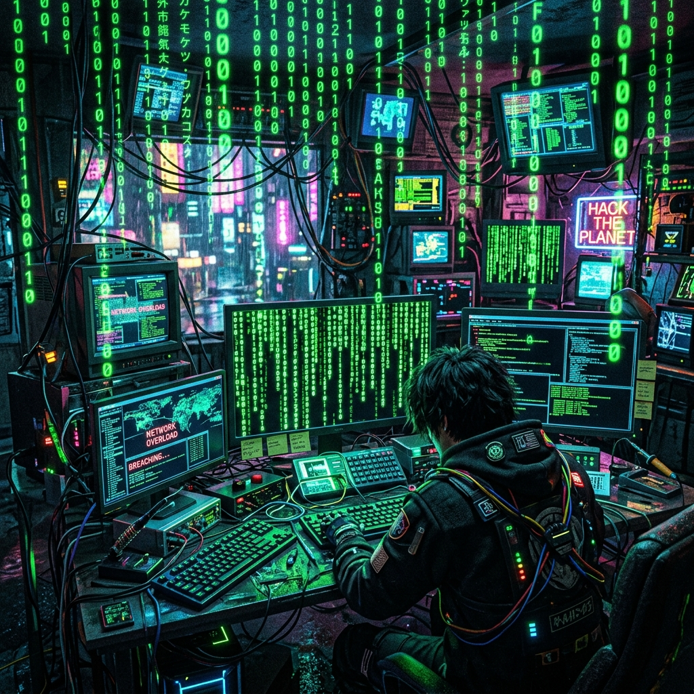

# FL-6: Image Curation

## 1. Real Captures over AI
I chose to use **real captures** for all my core project work (CCTV Tracking code, AKSARA UI, PRISMA dashboard) because AI cannot accurately replicate my actual system architecture. I also chose to use a **real professional photo** of myself for the Bio section to build genuine trust with Tech Recruiters.

*(Note for Michael: Please place your real screenshots and photo in this folder).*

## 2. AI-Generated Connective Tissue
For the background texture of my Hero section, I used AI to generate a consistent mood that matches my Identity Kit (Deep Navy & Electric Cyan).

**The Keeper (Accepted):**

*Why I kept it:* It is abstract, clean, and perfectly aligns with my Deep Navy and Electric Cyan color palette. It feels like a modern data-flow or neural network visualization without overpowering the text that will sit on top of it.

## 3. The Rejected Image
**The Darling I Killed (Rejected):**

*Why I rejected it:* I generated a "cyberpunk hacker" matrix background because it sounded cool in theory. However, the neon green completely clashes with my brand's Electric Cyan/Navy palette, and it is far too busy/chaotic. It would make my one-line claim completely unreadable and makes me look like an amateur rather than a serious researcher.
